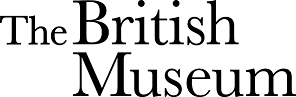
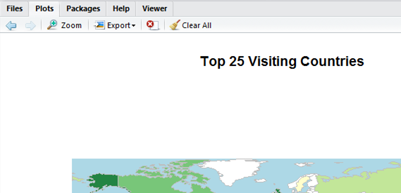

# Coding : R Lessons 

Date: November 2016

*This R lesson is for students or eager data champions to get an initial glimpse into the world of coding using the open source programming and statistical language R.*

*Download [R](https://www.r-project.org/) and [R studio desktop](https://www.rstudio.com/products/rstudio/download/) to get started.*

### Objectives: {#anchor}
* Learn how to load data into R 
* Learn how to make a tree map
* Learn how to make a wordcloud
* Learn how to make a map

***

### Getting Started {#anchor1}

**Set working directory and upload data**

Set the working directory tells R where you want it to find data and files.

For example :
```{r}
setwd("C:\\RLessons") 
```

Now you have told R where you have stored the data. Tell it to read the data you have in your folder including the names of the columns using "header=TRUE".


**Load Activities Data**
```{r}
actdata<-read.csv("activitieslist.csv",header=TRUE) 
```
This is example data of what activities student's spend their spare time on.

**View the data** 
Have a look at the data. Check R has read your data.
```{r,eval=FALSE}
View(actdata)
```

```{r,echo=FALSE}
actdata
```

**Dimension of the data**
```{r echo=TRUE}
dim(actdata)
```
16 rows and 2 column table


**What is your data made out of?**
```{r echo=TRUE}
str(actdata)
```

***

# TreeMap
Lets plot the activties data onto a tree map. 

**Install Package**

[Treemap Package](https://www.rdocumentation.org/packages/treemap/versions/2.4-1/topics/treemap)

```{r,warning=FALSE}
install.packages("treemap") #install the package called treemap
library(treemap) #tell R you want to use it now it is install onto your machine
```


**Create your first tree map**
```{r}
map1<-treemap(actdata, #tell R what data you want to use
        index="activities", #tell R what events you would like it to plot
        vSize="count",  #tell R what quantity you would like it to plot
        type="index")  #what type of treemap do you want to use
```

**Add a title and change the colours**

[Colour Brewer](http://www.ucl.ac.uk/~zctpep9/Archived%20webpages/Cookbook%20for%20R%20%C2%BB%20Colors%20(ggplot2).htm)

**Red to green colours treemap**
```{r}
map2<-treemap(actdata,
              index="activities",
              vSize="count",
              palette = "RdYlGn", #Try different colour use the link above
              type="index",
              title="Treemap of spare time activities") #Add title
```

**Bright colours treemap**
```{r}
map3<-treemap(actdata,
              index="activities",
              vSize="count",
              palette = "Set1", #Try different colour use the link above
              type="index",
              title="Treemap of spare time activities") #Add title
```


**Red treemap**
```{r}
map4<-treemap(actdata,
              index="activities",
              vSize="count",
              palette = "Reds", #Try different colour use the link above
              type="index",
              title="Treemap of spare time activities") #Add title
```

Jump to [Top](#anchor1)
***

# WordCloud
**Install Packages**
```{r,warning=FALSE,message=FALSE}
install.packages("wordcloud") #install the package called wordcloud
library(wordcloud) #tell R you want to use it now it is install onto your machine
```

**Creating a WordCloud**

[Wordcloud Package](https://www.rdocumentation.org/packages/wordcloud/versions/2.5/topics/wordcloud)

**Create a word cloud using the activities data**
```{r}
wordcloud1<-wordcloud(actdata$activities,actdata$count, #use the activities name (actdata$activities) and frequency of activites by students (actdata$count)
            scale=c(1.5,1),      #Add a scale so all the words fit on the page
            min.freq=1,          #Minimum word size quantity
            max.words=Inf,       #Max word size quantity
            random.order=FALSE,  #Order of words
            random.color=FALSE,  #Order of colours
            rot.per=.35,         #Rotation of words
            colors=brewer.pal(8, "Dark2")) #Set the colours - Try different Colours brewers
```

Worldclouds work really well with lots of data with a variety of sizes. 
Lets have a look at the British Museum example. 


**Words searched on the British Museum website**

Lets look at the words searched on the British Museum Website and Collections online in August

Load the data for August 2016. 
```{r}
augustdata<-read.csv("augustsearch.csv",header=TRUE) 
```
Now you have told R where you have stored the data - tell it so read data you have including the names of the columns.


Create a word cloud using the word searched data.
```{r}
wordcloud2<-wordcloud(augustdata$terms,augustdata$searches, #use the search terms (augustdata$terms) and frequency of searchs (augustdata$searches)
                      scale=c(3,.1),       #Add a scale so all the words fit on the page
                      min.freq=1,          #Minimum word size quantity
                      max.words=Inf,       #Max word size quantity
                      random.order=FALSE,  #Order of words
                      random.color=FALSE,  #Order of colours
                      rot.per=.35,         #Rotation of words
                      colors=brewer.pal(8, "Dark2")) #Set the colours #Try different brewer colours
```

Jump to [Top](#anchor)

***


# World Map
[Example Map Code](https://github.com/BritishMuseum/RGlobalMuseumMap)

[WorldMap Package](https://cran.r-project.org/web/packages/rworldmap/)

**Install Package**
```{r,warning=FALSE,message=FALSE}
install.packages("rworldmap") #install the package called rworldmap
library(rworldmap) #tell R you want to use it now it is install onto your machine
```

Lets look at the visits from around the world. This is an example of the website visits to the British Museum for August 2016 (Top 20 Countries).
```{r}
augdata<-read.csv("augustvisits.csv",header=TRUE)
```
Now you have told R where you have stored the data - tell it so read data you have including the names of the columns.

**Create a World Map**

Tell R what data you want to match the country data to the country names on the map.
```{r,message=FALSE}
map<-joinCountryData2Map(augdata,joinCode = "NAME",nameJoinColumn = "country" ) #Joining the data to a map
```

Creating a colour palette for the map.
```{r}
op <- palette(c("#ffffcc","#c2e699","#78c679","#238443")) #Light green to dark green colour palette
```

Find quartile breaks
```{r}
cut<- quantile(map@data[["visits"]],na.rm=TRUE) 
```

Print the quartile breaks for labelling 
```{r}
quantile(map@data[["visits"]],na.rm=TRUE)  
```

Cut the data for the labelling
```{r}
map@data[["number"]] <- cut(map@data[["visits"]],cut, include.lowest=TRUE )
```

Add the legend names
```{r}
levels(map@data[["number"]]) <- c("low","med","high","very high") #Type the legend colour quantile breaks
```

Produce the map with legend
```{r}
mapCountryData(map, #Use "map"
               nameColumnToPlot="number", #Column to plot
               catMethod="categorical",
               mapTitle="Top 25 Visiting Countries", #Add a title
               colourPalette="palette", #Use the colour palette assigned above
               oceanCol="lightblue",    #Change the colour to blue
               missingCountryCol="white") 
```

Show how to save in RStudio using the export button




Jump to [Top](#anchor)

***

## To continue learning R 

Try out [Data Camp - Introduction to R](https://www.datacamp.com/getting-started?step=2&track=r)

###Other helpful resources
* "#rstats" on twitter
* [R-Blogger](https://www.r-bloggers.com/)


